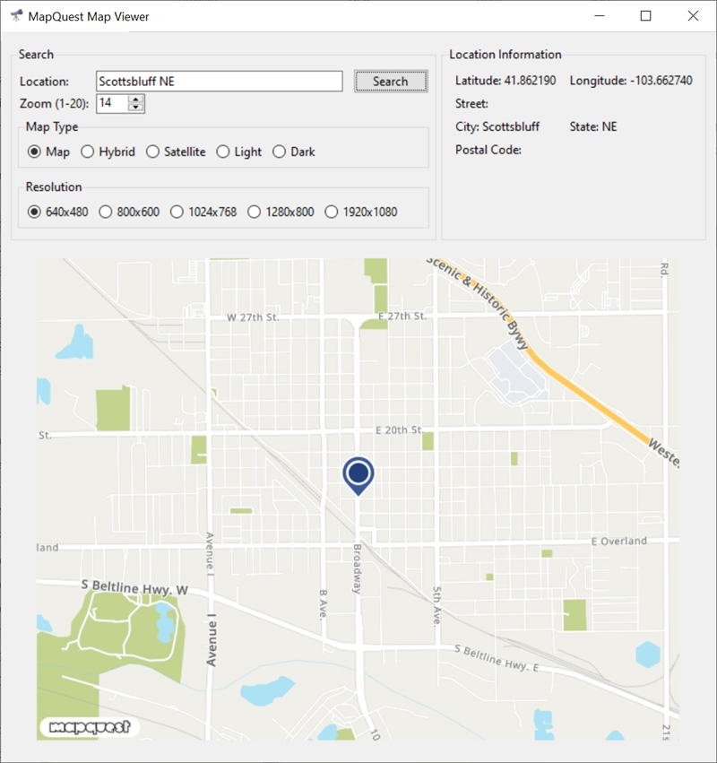

# MapQuest Map Viewer

Python Tkinter GUI programs to display a street map.

Batch files are included to use [Nuitka](https://pypi.org/project/Nuitka/) to convert the Python .py program to a Windows exe using GCC.

## Version History

- (11/06/2024) Initial commit

### License

 

This work is licensed under a [Creative Commons Attribution-NonCommercial-ShareAlike 4.0 International License](http://creativecommons.org/licenses/by-nc-sa/4.0/)</a>.

Copyright (c) 2024 William A Loring